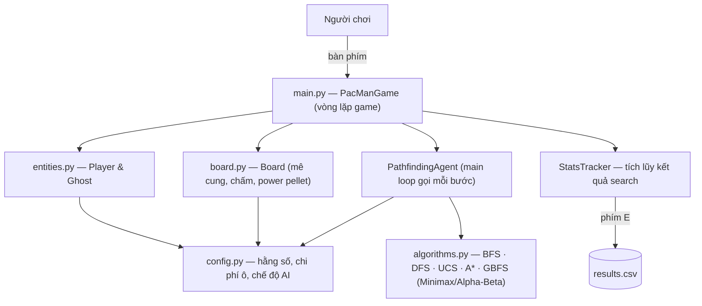

# 🟡 Pac-Man AI — Trực quan hóa giải thuật tìm kiếm

> Mô phỏng game Pac-Man bằng Pygame, dùng làm môi trường trực quan hóa và so sánh các giải thuật tìm kiếm trong Trí tuệ nhân tạo: **BFS, DFS, UCS, A\*, GBFS** (kèm cài đặt Minimax và Alpha-Beta Pruning).

## 📖 Giới thiệu

Đây là đồ án mô phỏng game Pac-Man, trong đó Pac-Man có thể được điều khiển **thủ công** hoặc **tự động tìm đường** đến mục tiêu bằng các giải thuật tìm kiếm.

Điểm cốt lõi của đồ án là **trực quan hóa quá trình tìm đường**:

- Đường đi dự kiến của Pac-Man.
- Các node (ô lưới) mà giải thuật đã xét/đã thăm.
- Thứ tự pop node trong hàng đợi / stack / priority queue.
- So sánh số bước, chi phí, số node đã thăm và thời gian chạy giữa các giải thuật.

Mỗi ô đi được trên map là một node, mỗi lần di chuyển sang ô kề là một edge — biến mê cung Pac-Man thành bài toán tìm kiếm trên đồ thị lưới.

**Đối tượng sử dụng:** sinh viên/giảng viên muốn demo và so sánh các giải thuật tìm kiếm không có thông tin (uninformed search) và có thông tin (informed search) trên cùng một môi trường.

## ✨ Tính năng

**Gameplay Pac-Man cổ điển**

- Điều khiển thủ công bằng phím mũi tên; ăn chấm, power pellet, né 4 con ghost (Blinky, Inky, Pinky, Clyde).
- Điểm số: chấm +10, power pellet +50, ăn ghost +200 và nhân đôi cho từng con tiếp theo trong một lần ăn pellet.
- Power pellet làm ghost chạy trốn và có thể bị ăn; ghost bị ăn quay về hầm rồi hồi sinh.
- 3 mạng, thắng khi ăn hết chấm, tunnel wrap-around hai bên map.
- Chế độ "ăn ghost vĩnh viễn" (phím `F`).

**AI tìm đường**

- 5 giải thuật tìm đường chuyển đổi bằng phím: `BFS`, `DFS`, `UCS`, `A*`, `GBFS`.
- `A*` và `GBFS` đổi được heuristic **Manhattan ↔ Euclidean** (phím `H`), có tính wrap-around của tunnel.
- `UCS` dùng chi phí ô thực (weighted cost map): ưu tiên đi qua ô có chấm, tránh vùng ghost house.
- Tự chọn goal mới khi ăn xong đường cũ, tự replan khi không tìm được đường.

**Trực quan hóa & đo lường**

- Hiển thị: path (đường xanh lá), visited nodes (chấm xanh dương), visited tích lũy qua nhiều lần replan, đường nối giữa các node đã thăm, marker start/goal.
- Step-by-step mode (`S` + `SPACE`): AI đi từng bước một để quan sát thứ tự node được xét.
- Bảng trace (phím `I`): thứ tự pop node, parent, edge cost, `g`, `h`, `f` (dành cho UCS/A*/GBFS).
- Bảng so sánh trung bình **steps / visited / cost / time (ms)** giữa các thuật toán (phím `TAB`).
- Xuất toàn bộ kết quả thực nghiệm ra `results.csv` (phím `E`).
- Cửa sổ tự thu nhỏ vừa màn hình; sprite tự thay bằng hình vẽ đơn giản nếu thiếu ảnh assets.

## 🛠️ Công nghệ sử dụng

| Thành phần | Công nghệ |
| --- | --- |
| Ngôn ngữ | Python ≥ 3.8.1 |
| Game / GUI | [Pygame](https://www.pygame.org/) 2.6.1 |
| Quản lý môi trường | `pip` + `requirements.txt`, hoặc `uv` (có sẵn `uv.lock`) |
| Build backend | Hatchling |
| Công cụ dev (khai báo trong `pyproject.toml`) | black, flake8, pytest |

Toàn bộ giải thuật (BFS, DFS, UCS, A*, GBFS, Minimax, Alpha-Beta) được **cài đặt thuần Python**, không dùng thư viện AI bên ngoài.

## 🏗️ Kiến trúc hệ thống

Game gồm 4 module chính, tách biệt vai trò:

- `main.py` — vòng lặp game (60 FPS), xử lý input, cập nhật trạng thái, vẽ HUD/panel/bảng so sánh, ghi thống kê (`StatsTracker`) và xuất CSV.
- `board.py` — giữ ma trận mê cung 30 cột × 32 hàng, trạng thái chấm, logic vẽ mê cung.
- `entities.py` — lớp `Player` (Pac-Man) và `Ghost` (di chuyển theo target, tốc độ thay đổi theo trạng thái).
- `algorithms.py` — các giải thuật tìm kiếm và lớp `PathfindingAgent` điều khiển Pac-Man: mỗi frame AI chạy search từ ô hiện tại đến goal rồi chuyển path thành hướng di chuyển.



**Chi phí ô dùng cho UCS/A\*** (trong `config.py`):

| Loại ô | Chi phí |
| --- | ---: |
| Ô có chấm (DOT) | 1 |
| Power pellet | 1 |
| Ô trống | 2 |
| Cổng ghost house | 10 |
| Ô nằm trong vùng ghost house | +5 |

Nhờ đó UCS tìm đường **tổng chi phí thấp nhất** (ưu tiên ô có chấm, né vùng ghost) chứ không đơn thuần là ít bước nhất như BFS.

**Đặc điểm từng giải thuật** (đúng như cài đặt):

- **BFS** — mở rộng theo lớp, ngắn nhất về số bước khi cost đều nhau, thường thăm nhiều node.
- **DFS** — đi sâu từng nhánh, có thể tìm nhanh nhưng không đảm bảo tối ưu (giới hạn độ sâu 100).
- **UCS** — tối ưu theo tổng chi phí, có thể xét nhiều nhánh không nằm trên đường đi cuối.
- **A\*** — `f(n) = g(n) + h(n)`, cân bằng giữa cost đã đi và ước lượng còn lại, thường thăm ít node hơn UCS.
- **GBFS** — `f(n) = h(n)`, lao thẳng về goal, nhanh nhưng không đảm bảo tối ưu.

## 📂 Cấu trúc thư mục

```
.
├── main.py                     # Vòng lặp game, HUD, visualization, bảng so sánh, xuất CSV
├── config.py                   # Toàn bộ hằng số: kích thước, màu, tốc độ, điểm, chi phí ô, chế độ AI
├── board.py                    # Ma trận mê cung 30×32 và logic vẽ
├── entities.py                 # Lớp Player (Pac-Man) và Ghost
├── algorithms.py               # BFS, DFS, UCS, A*, GBFS, Minimax, Alpha-Beta, PathfindingAgent
├── results.csv                 # Kết quả chạy mẫu (A* Manhattan) xuất từ phím E
├── HUONG_DAN_DO_AN_PACMAN.md   # Tài liệu hướng dẫn chạy + demo đồ án (tiếng Việt)
├── requirements.txt            # pygame==2.6.1
├── pyproject.toml              # Metadata project, dependency, cấu hình black/pytest
├── uv.lock                     # Lockfile cho uv
├── pacman_ai/                  # Package rỗng (placeholder để hatchling/uv build được)
└── assets/
    ├── player_images/          # 4 sprite Pac-Man (1.png → 4.png)
    └── ghost_images/           # 4 sprite ghost (red/pink/blue/orange) + powerup + dead
```

## ⚙️ Yêu cầu môi trường

- **Python ≥ 3.8.1** (theo `pyproject.toml`)
- **pygame 2.6.1** (theo `requirements.txt`)
- Chạy được trên Windows / macOS / Linux có hỗ trợ pygame
- Không cần database, không cần API key
- Tuỳ chọn: [uv](https://docs.astral.sh/uv/) nếu muốn chạy bằng `uv run`

## 🚀 Cài đặt và chạy

```bash
# 1. Clone repo
git clone <URL-repo>          # [CẦN BỔ SUNG] thay bằng URL repo của bạn
cd <tên-thư-mục-repo>

# 2. (Tuỳ chọn) tạo và kích hoạt môi trường ảo
python -m venv .venv
source .venv/bin/activate     # Windows: .venv\Scripts\activate

# 3. Cài dependency
pip install -r requirements.txt

# 4. Chạy game
python main.py
```

Nếu dùng **uv**:

```bash
uv run main.py
```

## 🔐 Cấu hình

Project **không dùng file `.env` hay secret nào**. Mọi cấu hình nằm trong `config.py` — sửa trực tiếp nếu muốn thay đổi:

| Nhóm cấu hình | Giá trị mặc định |
| --- | --- |
| Cửa sổ | `WIDTH = 900`, `HEIGHT = 950`, `FPS = 60` (tự thu nhỏ nếu màn hình nhỏ hơn) |
| Tốc độ | `PLAYER_SPEED = 2`, `GHOST_SPEED = 2`, `GHOST_SPEED_SCARED = 1`, `GHOST_SPEED_DEAD = 4` |
| Điểm | `SCORE_DOT = 10`, `SCORE_POWER_PELLET = 50`, `SCORE_GHOST_BASE = 200` |
| Thời gian | `POWERUP_DURATION = 600` frame, `STARTUP_DURATION = 180` frame |
| Chi phí UCS | `UCS_TILE_COSTS`, `GHOST_HOUSE_COST = 5`, vùng ghost house: rows 12–18, cols 11–18 |
| Adversarial search | `MINIMAX_DEPTH = 3`, `ALPHABETA_DEPTH = 4` |
| Vị trí xuất phát | `PLAYER_START_*`, `BLINKY/INKY/PINKY/CLYDE_START_*` |

## 🎮 Điều khiển

| Phím | Chức năng |
| --- | --- |
| Mũi tên | Điều khiển Pac-Man ở chế độ Manual |
| `1` | Manual Control |
| `2` | BFS |
| `3` | DFS |
| `4` | UCS |
| `5` | A* |
| `6` | GBFS |
| `G` | Tạo goal mới khi đang ở chế độ AI |
| `H` | Đổi heuristic Manhattan/Euclidean (A*, GBFS) |
| `V` | Bật/tắt hiển thị visited nodes |
| `P` | Bật/tắt hiển thị path (đường xanh lá) |
| `L` | Bật/tắt đường nối giữa các node đã thăm |
| `A` | Chuyển giữa visited hiện tại ↔ visited tích lũy |
| `I` | Bật/tắt bảng trace chi tiết (node, parent, edge, g, h, f) |
| `S` | Bật/tắt step mode |
| `SPACE` | Đi tiếp 1 bước trong step mode (giữ để auto-step) |
| `TAB` | Bật/tắt bảng so sánh thuật toán |
| `E` | Xuất kết quả ra `results.csv` |
| `F` | Bật/tắt chế độ ăn ghost (permanent power-up) |
| `R` | Reset game |

## 🖼️ Screenshots

<!-- Thêm screenshot của project tại đây -->

## 📚 Cách sử dụng

Quy trình demo điển hình:

1. Chạy `python main.py` — mặc định ở chế độ **Manual**, dùng phím mũi tên để chơi thử và kiểm tra map.
2. Nhấn `4` (UCS) hoặc `5` (A*) — Pac-Man tự tìm đường tới goal (ô được khoanh đỏ, thường là chấm nằm trong nhóm xa nhất). Đường đi hiện màu xanh lá, node đã thăm là chấm xanh dương.
3. Nhấn `S` rồi nhấn `SPACE` liên tục để xem AI đi **từng bước**; nhấn `I` để xem bảng trace `g/h/f` giải thích vì sao node tiếp theo được chọn.
4. Lần lượt nhấn `2` → `6` để mỗi thuật toán tích lũy kết quả, nhấn `TAB` xem **bảng so sánh** steps/visited/cost/time, nhấn `E` để xuất `results.csv` phục vụ báo cáo.
5. Nhấn `H` đổi heuristic cho A*/GBFS và so sánh visited giữa Manhattan và Euclidean.
6. Thắng khi ăn hết chấm, thua khi hết 3 mạng; nhấn `R` để chơi lại từ đầu.

Chi tiết ý nghĩa từng bảng hiển thị có trong [`HUONG_DAN_DO_AN_PACMAN.md`](HUONG_DAN_DO_AN_PACMAN.md).

## 👨‍💻 Thành viên

- Tác giả khai báo trong `pyproject.toml`: Natnael Yohanes
- Danh sách thành viên đầy đủ: [CẦN BỔ SUNG]

## 📄 License

Chưa có file LICENSE trong repo — license chưa được xác định. [CẦN BỔ SUNG]

---

## ⚠️ Lưu ý

- **Minimax và Alpha-Beta đã được cài đặt đầy đủ** trong `algorithms.py` (và `MODE_MINIMAX` có trong `config.py`), nhưng **chưa được gán phím** trong `main.py` (phím `6` hiện là GBFS). Muốn dùng phải gọi qua code, ví dụ `AlphaBeta.get_best_move(...)`.
- Nhấn `E` sẽ **ghi đè** `results.csv` ở thư mục gốc project.
- `results.csv` hiện có sẵn trong repo chỉ là kết quả chạy mẫu (A* Manhattan), có thể xóa mà không ảnh hưởng game.
- `pyproject.toml` khai báo `testpaths = ["tests"]` nhưng repo **chưa có thư mục `tests`** — chạy `pytest` sẽ không có test nào được thực thi.
- Font `freesansbold.ttf` đi kèm pygame nên không cần cài thêm; nếu thiếu ảnh trong `assets/`, game tự vẽ hình tròn thay thế thay vì báo lỗi.
